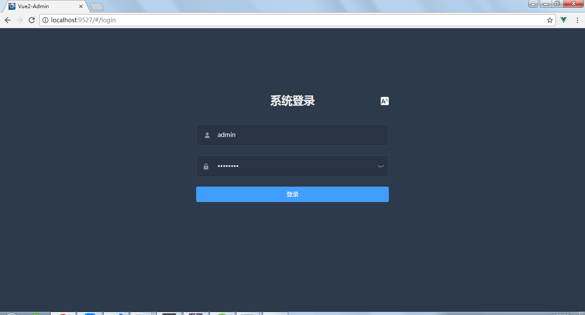
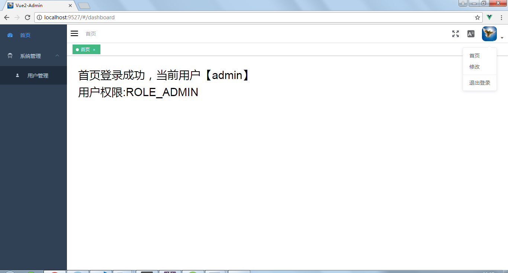
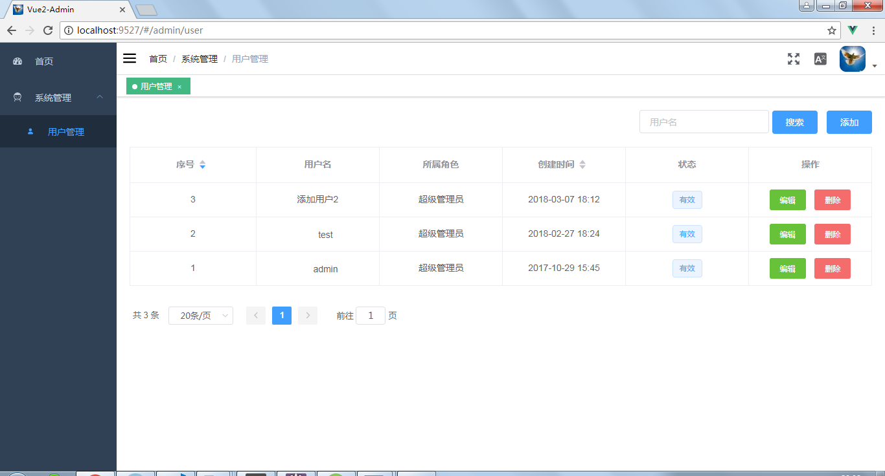
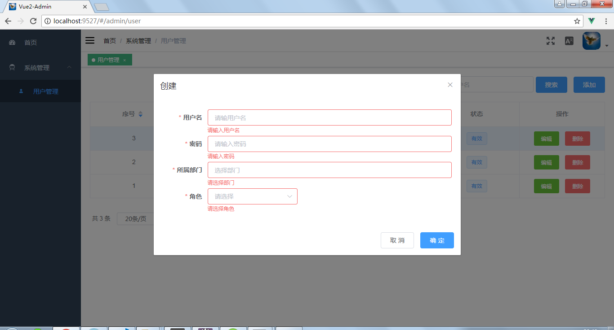
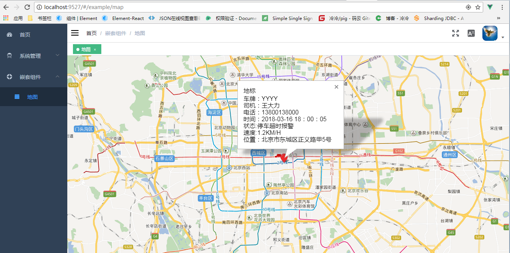
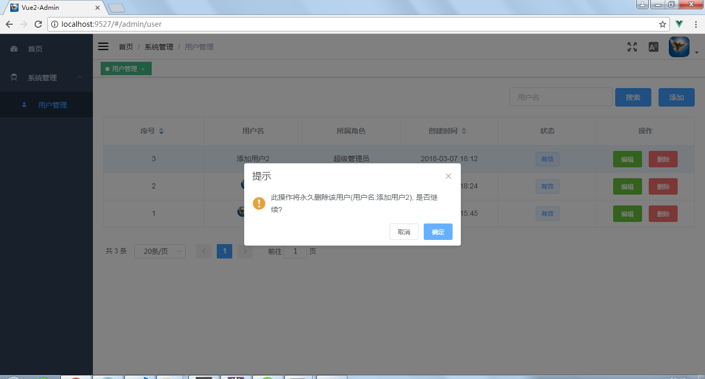
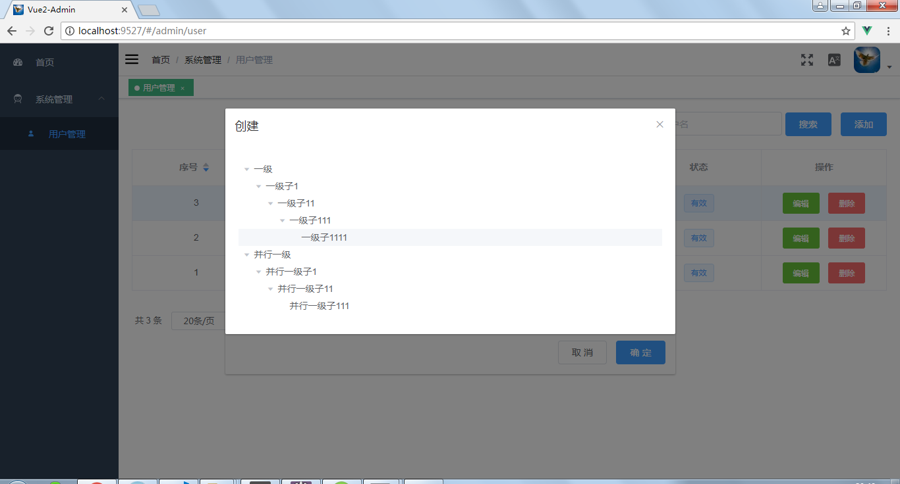

## Vue2-Admin 简介

`Vue2-admin` 是基于 [vue-element-admin](https://github.com/PanJiaChen/vue-element-admin) 一个后台包含登录、权限管理的精简版本，可以在基础上进行业务开发

## 在线访问
* [Vue2-Admin 点击访问](http://47.106.144.24/mall/index.html)

## 前序准备

你的本地环境需要安装 [node](http://nodejs.org/) 和 [git](https://git-scm.com/)。技术栈基于 [ES2015+](http://es6.ruanyifeng.com/)、[vue](https://cn.vuejs.org/index.html)、[vuex](https://vuex.vuejs.org/zh-cn/)、[vue-router](https://router.vuejs.org/zh-cn/) 、 [element-ui](https://github.com/ElemeFE/element) 和 [vue2-all](https://github.com/liuweijw/Vue2-All)

## 数据接口准备

你本地可以采用mock数据进行本地调试，同时也可以配合[服务接口API](https://github.com/liuweijw/fw-cloud-framework)进行开发

注：去掉mock很容易，注释main.js 中的 import './mock' 并删除 mock 文件夹即可

## 开发
```bash
# 克隆项目
git clone https://github.com/liuweijw/Vue2-Admin.git

# 安装依赖
npm install
   
# 建议不要用cnpm安装 会有各种诡异的bug 可以通过如下操作解决 npm 下载速度慢的问题
npm install --registry=https://registry.npm.taobao.org

# 启动服务
npm run dev
```
浏览器访问 http://localhost:9527

## 发布
```bash
# 构建测试环境
npm run build:sit

# 构建生成环境
npm run build:prod
```

## 其它
```bash
# --report to build with bundle size analytics
npm run build:prod --report

# --preview to start a server in local to preview
npm run build:prod --preview

# lint code
npm run lint

# auto fix
npm run lint -- --fix
```
## 效果图








## 感谢

[vue-element-admin](https://github.com/PanJiaChen/vue-element-admin)

[Vue2-All](https://github.com/liuweijw/Vue2-All)
